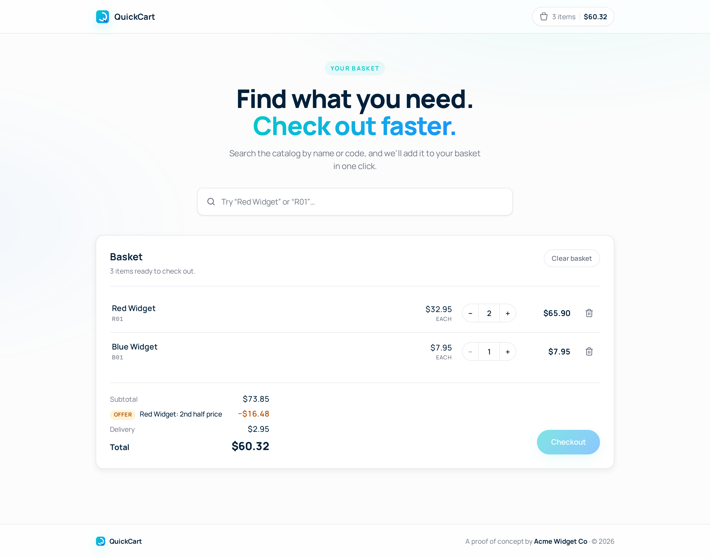

# QuickCart — client

React 19 + Vite frontend for the Acme Widget Co basket. A single-page app
that talks to the Laravel API, renders the basket, and surfaces toasts on
every mutation.

> Run from the repo root via Docker Compose. This README covers
> client-specific commands, structure, and conventions.

## Preview



The screenshot shows a basket with `2 × Red Widget` and `1 × Blue Widget`:
the BOGO offer takes $16.48 off, delivery is $2.95 (under-$50 tier),
total $60.32. To regenerate it, see [Updating the screenshot](#updating-the-screenshot).

## Running

The client is brought up by the root `docker compose up -d` and is
reachable at <http://localhost:4000>. Vite is configured to bind on
`0.0.0.0:4000` inside the container, with HMR working through the
docker-compose port mapping.

## Common commands

All commands run **inside the container**:

```bash
# enter a shell
docker compose exec client sh

# install / re-install dependencies
docker compose exec client npm install

# production build
docker compose exec client npm run build

# preview the production build locally
docker compose exec client npm run preview

# lint
docker compose exec client npm run lint
```

If you'd rather run npm directly on the host (not required), Node 18+ is
needed. The Dockerfile uses Node 20.

## Folder structure

```
client/
├── public/
│   └── favicon.svg            QuickCart Q-cart monogram, teal→blue gradient
├── src/
│   ├── api.js                 fetch wrapper, credentials: 'include'
│   ├── format.js              formatMoney(cents) → "$32.95"
│   ├── App.jsx                shell + route placeholder
│   ├── App.css
│   ├── Home.jsx               the page: search, basket, summary, footer
│   ├── Home.css               styled with design tokens from index.css
│   ├── Toast.jsx              useToasts() hook + <ToastStack /> component
│   ├── index.css              design tokens (Manrope, colors, radius, shadow)
│   └── main.jsx
├── docs/
│   └── home.png               screenshot used in this README
├── index.html                 title, favicon link, theme-color, meta desc
├── vite.config.js
├── eslint.config.js
└── package.json
```

## Design tokens

Defined as CSS custom properties in `src/index.css`:

| Token              | Value      | Usage                       |
| ------------------ | ---------- | --------------------------- |
| `--color-text`     | `#01203A`  | Navy body text              |
| `--color-accent`   | `#02CBC9`  | Teal — pills, focus rings   |
| `--color-bg`       | `#FCFCFC`  | Off-white page background   |
| `--color-card`     | `#FFFFFF`  | Card surfaces               |
| `--radius`         | `12px`     | Corner radius               |
| `--shadow-soft`    | …          | Card elevation              |

The accent gradient (`#02cbc9 → #1e90ff`) is used on the brand mark, hero
title accent, and primary CTA.

Font: **Manrope**, loaded via Google Fonts.

## State & data flow

- All basket state comes from the server. Each mutation (`add`,
  `setQuantity`, `remove`, `clear`) goes through `api.js` and the
  response — the full priced basket — replaces local state.
- The frontend never duplicates pricing logic. If the server says the
  total is `$60.32`, that's what the UI shows.
- `useToasts()` (in `src/Toast.jsx`) is a tiny in-component toast system:
  no provider, no portal, auto-dismiss after 3s, stacks bottom-right.
- The search input is debounced via a small `useDebounced` hook.

## Adding to the basket

`Home.jsx` keeps a single `withBusy(fn, successMessage)` helper. Every
handler reads:

```js
withBusy(() => api.addToBasket(product.code), `Added ${product.name}`)
```

…which:
1. Sets the busy flag.
2. Awaits the API call.
3. Replaces basket state with the server's snapshot.
4. Pushes a success toast (or an error toast on failure).

## Discount UI

The summary section renders one row per discount returned by the server:

```
[OFFER] Red Widget: 2nd half price ×2     −$32.96
```

The `×N` pill is rendered only when the discount's `times_applied` is
greater than 1 — a single application is implicit and the pill would just
be noise. Field comes from the Offer strategy on the server (e.g.
`RedWidgetBogoHalfPrice` returns `times_applied => $pairs`).

## Updating the screenshot

The screenshot in this README is captured against the running app so it
always reflects current styling. There's no committed tooling for it; run
this one-off from a terminal with Node ≥ 18:

```bash
mkdir -p /tmp/quickcart-shot && cd /tmp/quickcart-shot
npm init -y >/dev/null
npm install playwright-chromium
npx playwright install chromium
```

Then create `shoot.js`:

```js
const { chromium } = require('playwright-chromium')

const OUT = process.argv[2] // pass an absolute path

async function add(page, code) {
  await page.fill('input.search__input', code)
  const row = page.locator('.search__item', {
    has: page.locator('.search__item-code', { hasText: new RegExp(`^${code}$`) }),
  }).first()
  await row.waitFor({ state: 'visible' })
  await row.click()
  await page.locator('li.line', {
    has: page.locator('.line__code', { hasText: new RegExp(`^${code}$`) }),
  }).first().waitFor({ state: 'visible' })
}

;(async () => {
  const browser = await chromium.launch()
  const ctx = await browser.newContext({
    viewport: { width: 1440, height: 900 },
    deviceScaleFactor: 2,
  })
  const page = await ctx.newPage()
  await page.goto('http://localhost:4000', { waitUntil: 'networkidle' })

  // start clean
  const pre = page.getByRole('button', { name: /clear basket/i })
  if (await pre.count()) await pre.click().catch(() => {})

  await add(page, 'R01')
  await add(page, 'R01')
  await add(page, 'B01')

  await page.locator('.hero__title').click()    // close search dropdown
  await page.waitForTimeout(3800)               // let toasts auto-dismiss
  await page.screenshot({ path: OUT, fullPage: true })

  const clear = page.getByRole('button', { name: /clear basket/i })
  if (await clear.count()) await clear.click().catch(() => {})
  await browser.close()
})()
```

Run it with the absolute path to the screenshot:

```bash
node shoot.js "$(pwd)/../<repo>/client/docs/home.png"
```

The dev server must be up (`docker compose up -d`).
